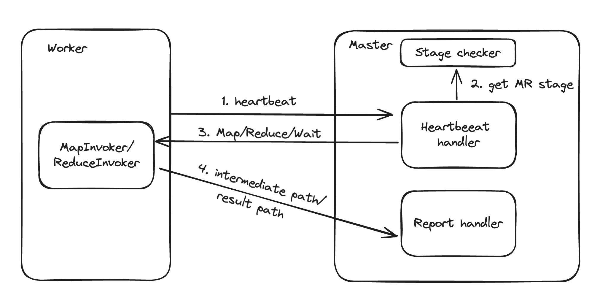
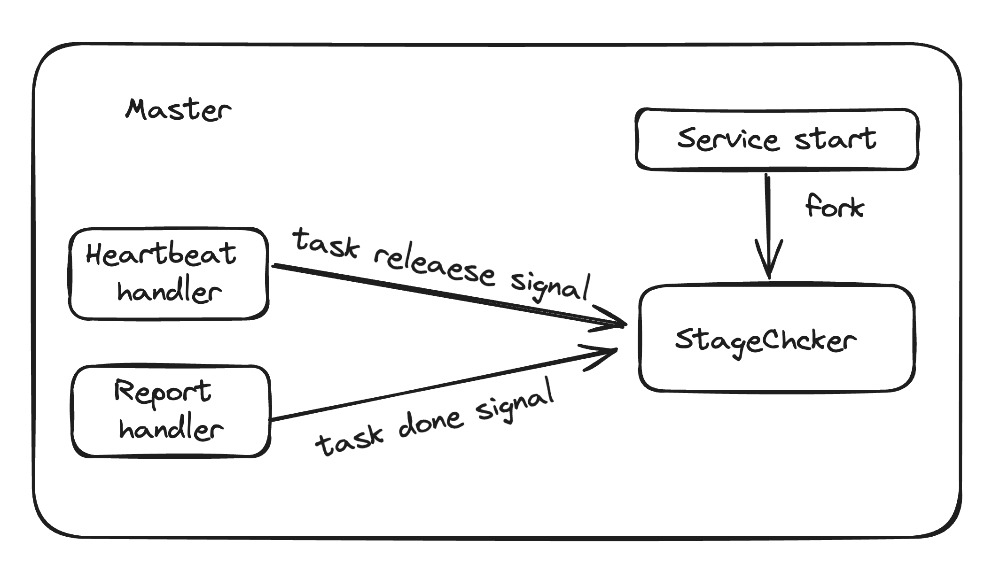

# L1

[什么是 MapReduce](https://zh.wikipedia.org/wiki/MapReduce)


## 1. Master-Worker 整体交互



MapReduce 采用多 worker 单 master 架构，以单 worker 为例，Master-Worker 交互流程如下：

* worker 向 master 定期发送 heartbeat
* master 的 heartbeat handler 在接受到心跳包后，从 stage checker (详见 part 2) 获取 MR 任务所处阶段，通过 heartbeat response 向 worker 分配指定类型任务 ( Map / Reduce / Wait / Exit ) 并携带任务所需参数
* worker 在完成相应任务后，向 master 上报任务执行结果，由 master 进行结果保存并进行 stage 轮转。


```go
// Worker's heartbeat loop
//, continuely send heartbeat to server 

for {
    // resp contain the necessary info needed by map task and reduce task
		resp := HeartBeat(args)
		switch resp.JobType {
		case MAP:
			invokeMap(mapf, resp)
		case REDUCE:
			invokeReduce(reducef, resp)
		case WAIT:
			time.Sleep(time.Second * 1)
		case EXIT:
			return
		}
	}

// Master's heartbeat handler
func (c *Coordinator) HeartBeat(args *HeartBeatArgs, reply *HeartBeatReply) error {
	c.mu.Lock()
	defer c.mu.Unlock()
	switch c.stage.tag {
	case MapProcess:
		c.handleMap(w, reply)
	case ReduceProcess:
		c.handleReduce(w, reply)
	case WaitForDoneProcess:
		c.handleWait(w, reply)
	case WaitForReduceProcess:
		c.handleWait(w, reply)
	case DoneProcess:
		c.handleDone(w, reply)
	}
	reply.NReduce = c.nReduce
	return nil
}
```

## 2. StageChecker

本实现将 MR 任务进程的监控、流转等过程抽取为 StageChecker 模块。该模块将任务状态维护与其它流程充分解耦。

StageChecker 基于 channel 实现



StageChecker 流转过程

* 当 master 服务启动时，fork 出 stageChecker 协程，维护 MR 任务进程 的状态变量，比如 已下发/已完成 的 map/reduce 任务数量；

* stage checker 通过监听 channel，更新各状态变量，并在状态变量满足一定条件后，进行 MR 进程轮转

通过 channel 轮转状态，可能存在以下问题：

* 阻塞/~~非阻塞~~：若 channel 有缓冲，则可能出现 信号已发送，但状态未更新的 case，导致 heartBeat 读到错误状态而 panic
* 多个 worker 并发发送 hearBeat 时，获取状态+获取资源是串行的
  * 比如只剩最后一个 map task，但此时有两个 worker 读到了 Process_Map，此时会 panic
* stageChecker 与 heartBeat 线程应有 同步手段；hearbeat 中的状态读取应该等到 stageChecker 更新完状态后再进行，否则可能读到未更新的状态；

```go
// stageChecker 监听 channel
for {
  switch <-c.stage.stageCh {
  case MapDone_Sig:
    mapTaskDone++
      // ....
  }
}
```

## 3. 容错与 backup

根据 MapReduce 论文，本实现重点考虑 worker fail 的场景。当 master fail 时，直接重跑整个任务；

worker fail 的可能原因很多，如 网络拥堵、worker 进程推出、worker 实例 crash。但从 master 的视角来看，都是长时间无法接收到 worker 的执行结果。

因此，master 端可以屏蔽掉所有错误类型，通过计时器来实现对未响应任务的重新下发。

注意事项：

* 当任务被重新被放回空闲队列时，可能导致 MR 任务进程回退 ( 比如从 WaitForReduceProcess 回退到 MapProcess )，因此需要向 stageChecker 发送 retrySig

* 定时器到时可能是因为网络阻塞，此时同一个 Map 任务会被多次执行并上报，Master 要实现对 Map 任务的**幂等**

```go

// 定时器方法
func (c *Coordinator) asyncTaskTimer(retryTime time.Duration, taskId int, flag int) {
	select {
	case <-time.After(retryTime):
		if flag == 0 {
			// 探测 map 任务是否已经完成
			// ...
		} else if flag == 1 {
			// 探测 reduce 是否已经完成
			// ...
		}
	}
}

// 每次任务下发都会启动定时器协程
func (c *Coordinator) handleMap(w *worker, reply *HeartBeatReply) {
	// ...
	go c.asyncTaskTimer(10*time.Second, releaseMapTask.id, 0)
}
```