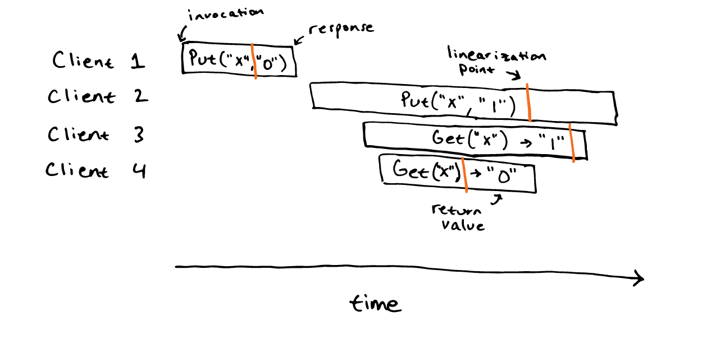

# L2

## 1. Linearizability

* 在线性化的系统中，每个操作都视作是 瞬时的、原子的
* 线性化系统满足：尽管请求是并发且持续一段时间的，系统的最终状态可以视为并发请求瞬间作用的结果；

The notion of linearization point is part of one strategy for checking
whether a history is linearizable. Actual implementations do not usually
involve an explicit notion of linearization point. Instead, they
usually just execute incoming requests in some serial (one-at-a-time)
order. You can view each operation's linearization point as occuring
somewhere during the time in which the service is executing the request.
